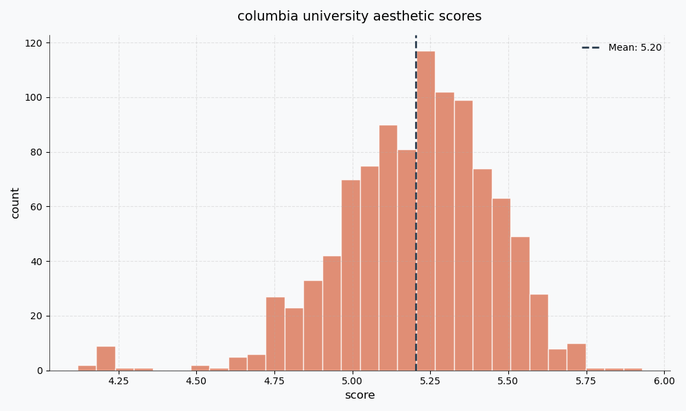

## UniScores

This is a project I'm working on to try and "objectively" classify how pretty universities are with AI! I need help pulling all the images, so here's a quick setup guide if you'd like to help expand this :)

## How to contribute!

> $ pip install -r requirements.txt

> $ python pull_images.py --num_points 1000 --uni_starting_idx [X] --n_unis 25

Replace the `[X]` with the first index that hasn't yet been catalogged. As of last update, that index is **20**! You'll also have to set your environment's `GOOGLE_MAPS_API_KEY` variable to be your Google Maps API key. 

Be careful running this script a bunch as it can very quickly eat your credits. One run with these parameters is guaranteed to be under the free monthly quote of $200. 

Once you've done your run, feel free to leave an issue letting me know! I'm still figuring out a way to quickly get share images between one another.